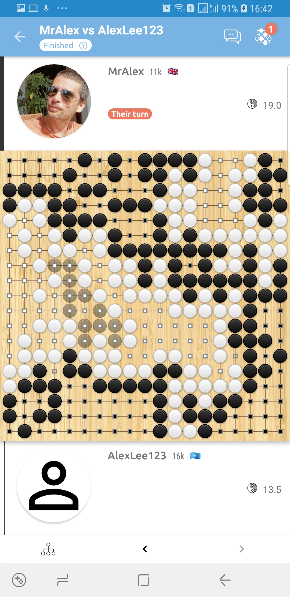
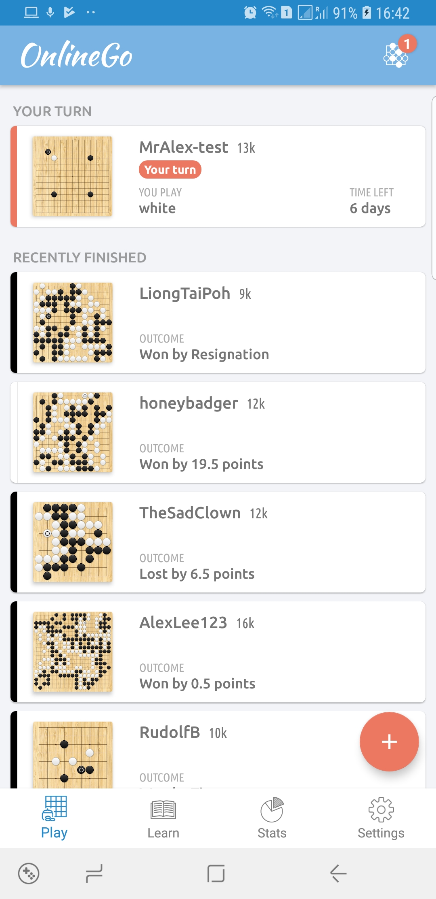
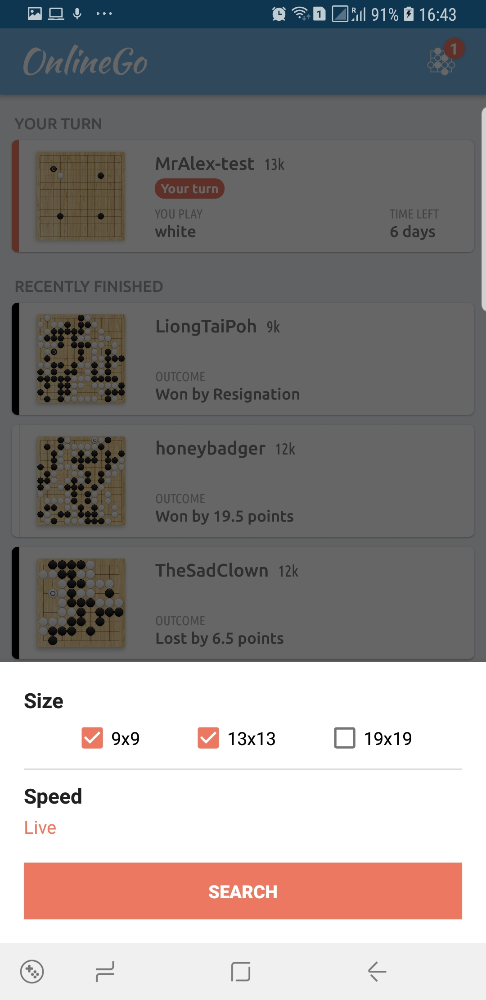

# OnlineGo Android App

This app allows you to play the ancient game of GO (baduk, weiki, 围棋,
바둑, 囲碁) against other players. The backend is provided by the popular
[OGS](https://www.online-go.com) website. You can install the latest release build from the [Play Store](https://play.google.com/store/apps/details?id=io.zenandroid.onlinego).

## Screenshots

    
    
    

## Contributing

Although this project has been my playground for trying out new techologies you are welcome to contribute. Just pick something that you want to work on (either from the issues or some other feature you'd like to see implemented), check with me that it's not already being worked on, checkout the project, create a branch, work your magic and when done raise a PR for merging back to master (which is protected).

I'm afraid that I don't have much time to offer support for prospective contributors, but if you run into problems please raise an issue and tag me in it, I will try to answer as time allows. You will find it easier if you are familiar with Kotlin, RxJava, Room, MVP (and in some of the new stuff MVI), Retrofit and general Android development. If not, maybe it's a good way of introducing yourself to these popular technologies.

## Non-coding contributions

Since I am a coder by trade, I realize some of the non-coding aspects of the app are not quite up to par. While I did my best to locate free assets online for example, I could not always locate appropriate icons. The icons I did manage to locate are not always in the same style and quality (varying stroke weights, etc). If a professional graphical artist would like to contribute their time for this I would definitely not object.

UX is another area that could use improvement. I have some figma mockups that I use but I could benefit from some assistance here as well.

## Donations

If you don't have the technical expertise and/or time to contribute to the project but still want to support my efforts, you can become a supporter by using the button at the top of the page or this [link](https://github.com/sponsors/acristescu). While it is really unlikely that this project will ever generate enough income to warrant me working full-time on this, I will naturally feel more inclined to spend my spare time on it the more backers it gets.

## Contributors

 - [Alexandru Cristescu](https://github.com/acristescu) (Original author)
 - [popz73](https://github.com/popz73)
 - [frony](https://github.com/bqv)
